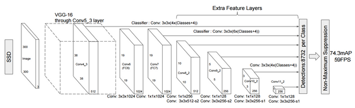
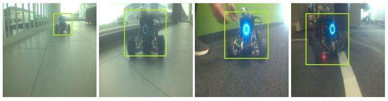
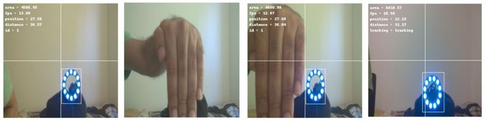
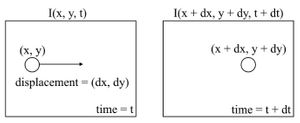
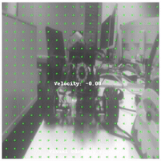
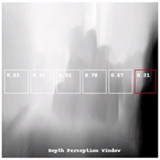
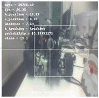
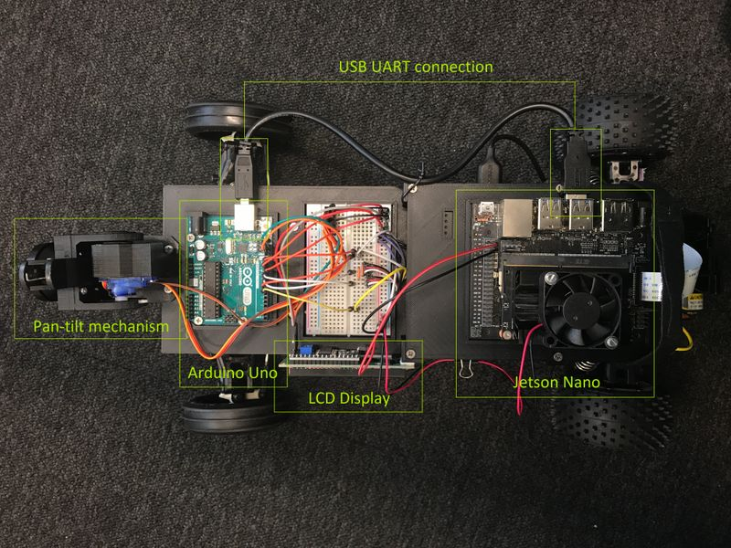

# Platooning Demonstrator

Originally envisioned as a demonstrator for an AI Conference, the *platooning* system consists of two cars, a *leading car* and a *following car*. The leading car can be driven manually using a PS4 controller and the following car will autonomously follow the leading car. 

In addition to this, the system currently is also capable of *Object Tracking*, *Velocity Estimation by Optical Flow Visual Odometry* and *Monocular Depth Estimation*.

---

## Abstract

A sample output of what the following car *sees* in its camera stream is shown below.

### Object Detection

The following car utilizes an *Object Detection DNN*, amongst other things, to identify and localize the leading car in its input camera stream with a *bounding box*. The object detection architecture is an *Inception V2* Convolutional Neural Network with a *Single Shot Detector (SSD)* for the actual object detection. 

Information about the SSD can be found at https://arxiv.org/abs/1512.02325. The VGG-16 part is replaced by the Inception CNN. 

 

More details about the Inception V2 architecture can be found at https://arxiv.org/abs/1512.00567. The Inception architecture was chosen for its good tradeoff between speed and performance when compared to other models that are optimized to run on embedded systems. The comparision can be found at https://arxiv.org/abs/1611.10012. 

*Transfer Learning* was used in order to repurpose a SSD Inception model trained on the COCO (Common Objects in COntext) dataset, modified to detect a single class of objects - the leading car. Let us call this *custom* object detection. We use images such as the ones shown below with the leading car in different environments, labelled by a bounding box for the training.

Tensorflow provides a pretrained model of this architecture. For information on the custom object detection training routine, you can refer https://tensorflow-object-detection-api-tutorial.readthedocs.io/en/latest/training.html. The retraining of the model is done on a Goole Colab notebook to make use of the free (!) Tesla GPU and 64 GB RAM. The model can be fully or partially retrained based on performance needs. If privacy or data security is a concern, the notebook can be run on a local machine.

The Inference of the model is accelerated by TensorRT, details of which can be found at https://docs.nvidia.com/deeplearning/frameworks/tf-trt-user-guide/index.html.

### Object Tracking

The detected leading car is assigned an ID in order to identify it as a member of a series of platooning cars. If the leading car steers off frame and then reappears, the rudimentry tracking algorithm is capable of identifying that the car that is back in frame is the car with the same ID. It uses mathematical concepts such as maximizing the IOU (Intersection Over Union) metrics between bounding boxes in neighboring frames.This is made possible by, amongst other things, a Kalman Filter. The implementation details can be found at https://arxiv.org/abs/1602.00763.

  

### Velocity Estimation

Optical flow methods utilize the differences in pixel intensities across consequent frames to calculate apparent motion.

 

This fundamental method is usually used to determine the flow of an object across a frame, but gave me an idea that it can also be used to used to calculate self velocity (velocity of the following car) by considering the car itself as the moving object. The function *calcOpticalFlowFarneback* from OpenCV that facilitates this is the based on the paper found at https://rd.springer.com/chapter/10.1007/3-540-45103-X_50.

### Depth Perception

This is an effort to be able to sense depth information (monocular) from a 2D camera. Implementation details can be found at https://arxiv.org/abs/1806.01260. 

A rudimentary use case of this for obstacle detection has been implemented. THe depth perception window displays the observed depths of the environment in a grayscale map (0-255, normalized). A grayscale pixel value of 0 would indicate the object being further away and a Grayscale value of 255 woud indicate an object being the closest. Based on this, a horizontal grid of so called *superpixels* (cool name, right?!) is defined. The averaged grayscale value within these superpixels is noted and based on this a decision is made as to whether an obstacle is detected or not. A predefined threshold turns the superpixel window red when an obstacle is detected. 

---

### Working Principle

The area of the bounding box generated fromt the object detection determines the speed at which the following car keeps up with the leading car - the smaller the area, the further away the leading car is, requiring a larger acceleration and vice versa. 

  

The following car is also designed to maintain a fixed safe distance to the leading car based on the bounding box area. The vertical separator divides the frame into two halves and the centroid of the bounding box and its position along the x axis determines the steering angle of the following car. 

The camera system also includes a pan-tilt mechanism, which is tasked with orienting the center of the camera to the center of the bounding box which in turn is used to set the steering angle. This provides an additional degree of freedom to the following method and helps when there are relatively sharp turns made by the leading car. 

---

## Getting Started 

These instructions will get you up and running on your local machine for development and testing purposes. 

* For the current cars, make sure a common WiFi is up and running, and you are connected to it on you local machine. Switch to whichever common WiFi you and the Jetson Nanos stay on apart from this.

* Make sure all the physical connections shown below are in place for both cars and especially that the Arduino Uno is connected to the Jetson Nano via the USB UART.

* The <u>leading car</u> does not require you to connect a HDMI cable or a keyboard. You can directly power up the leading car and its Jetson Nano and then navigate to http://192.168.88.180:8888/lab on your local machine. This takes you to the Jupyter Lab interface with the server runnig on the Jetson and your access to it via ssh. 

    * Following this, start the PS4 controller. Now open up a terminal in the Jupyter Lab interface and type '**ds4drv**' to get the driver running for the bluetooth controller pairing. You should see a message scanning for devices. Now press and hold the '**PS**' + '**share**' buttons simultaneously. The controller will pair, blink and change the LED bar to a constant light blue, and then disconnect. (Don't ask me why, just driver issues). Now following this, again press and hold the '**PS**' + '**share**' buttons simultaneously untill the light bar throbs and turns deep bright blue, an indication that proper pairing is complete. Throbbing usually indicates trying to pair.

    * Just in case if ever required, the login id and password are both '**jetson2**'.

    * Fire up the '**leading_car**' Jupyter Notebook inside the *leading_car* folder. Further instructions are in the cells of the notebook as comments. 

* The <u>following car</u> requires that you connect a HDMI monitor to the Jetson Nano, a keyboard and then the power cable, in this order. The Jetson Nano is set up in a *Headless* mode. When prompted for a login, enter '**jetson**' as the username and also the password. After login you can disconnect the keyboard and HDMI cable.

    * Open up a browser, preferably Chrome and enter the following address http://192.168.88.202:8888/lab. This should lead you to a Jupyter Lab server running on the Jetson Nano but access via ssh from the local system.

    * Fire up the '**following_car**' Jupyter Notebook inside the *following_car* folder and proceed to deployment of the system. Further instructions are in the cells of the notebook as comments.  

---

## Prerequisites

* An install script is provided by the name 'install_requirements.sh' that hopefully installs everything you need to set up a fresh new SD card for a <u>new</u> Jetson Nano with a similar configuration as the current cars.

* As part of the script it installs stuff like Tensorflow, PyTorch, Jupyter Lab and packages associated with it and more. If the script fails, just follow whats inside step by step. Whatever is needed apart from what's in the script, please install manually.

### Connections 

 

---

## Known Issues and Improvements

* Convert all PIL based operations to their OpenCV counterparts or vice versa for uniformity and elimibating the redundancy of using two image processing libraries.
* Implementing the PID controller with for the actuall throttle values
---

## Acknowledgments

* https://github.com/FangGet/tf-monodepth2
* https://github.com/nianticlabs/monodepth2
* https://github.com/NVIDIA-AI-IOT/jetracer
* https://github.com/NVIDIA-AI-IOT/jetbot
* https://github.com/dusty-nv/jetson-inference
* https://github.com/abewley/sort 
* https://github.com/NVIDIA-AI-IOT/jetcam
* https://github.com/NVIDIA-AI-IOT/tf_trt_models
* https://github.com/NVIDIA-AI-IOT/torch2trt
* https://github.com/dwofk/fast-depth
* https://github.com/tzutalin/labelImg
* https://nanonets.com/blog/optical-flow/

---

## Authors

* Shankar Kumar

---